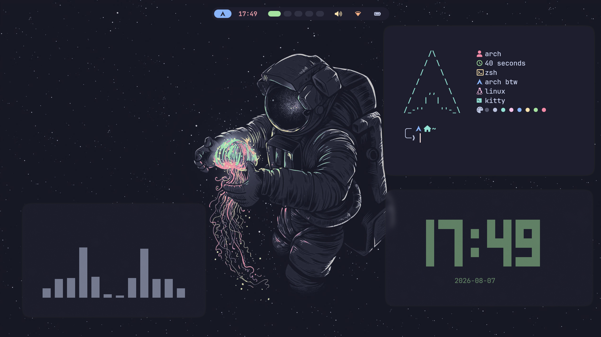

# Keybinds
SUPER + ENTER = Open kitty terminal
SUPER + Q = Close window
SUPER + D = Open wofi app launcher
SUPER + B = Open firefox browser
SUPER + E = Open yazi file manager
SUPER + N = Open nvim editor
SUPER + S = Screenshot and copy it to clipboard
SUPER + W = Switch waybar layout
SUPER + F = Toggle window float
ALT + C = Poweroff system
ALT + V = Reboot system
ALT + M = Logout
ALT + L = Lock system
SUPER + H/J/K/L = Window navigation
SUPER + SHIFT + H/J/K/L = Move Window
SUPER + 1-9 = Switch workspaces
SUPER + SHIFT + 1-9 = Move window to another workspace
SUPER + X = Volume up
SUPER + Z = Volume down
SUPER + SHIFT + X = Brightness up
SUPER + SHIFT + Z = Brightness down
# Prerequisites
1. A fully functional Arch Linux setup
2. Curl
# Installation
```bash
bash <(curl -fsSL https://raw.githubusercontent.com/excellogalihs/friedrice/main/install.sh)
```
That's basically it. You get a usable and beautiful Arch Linux Hyprland setup with the Catppuccin Mocha theme.
