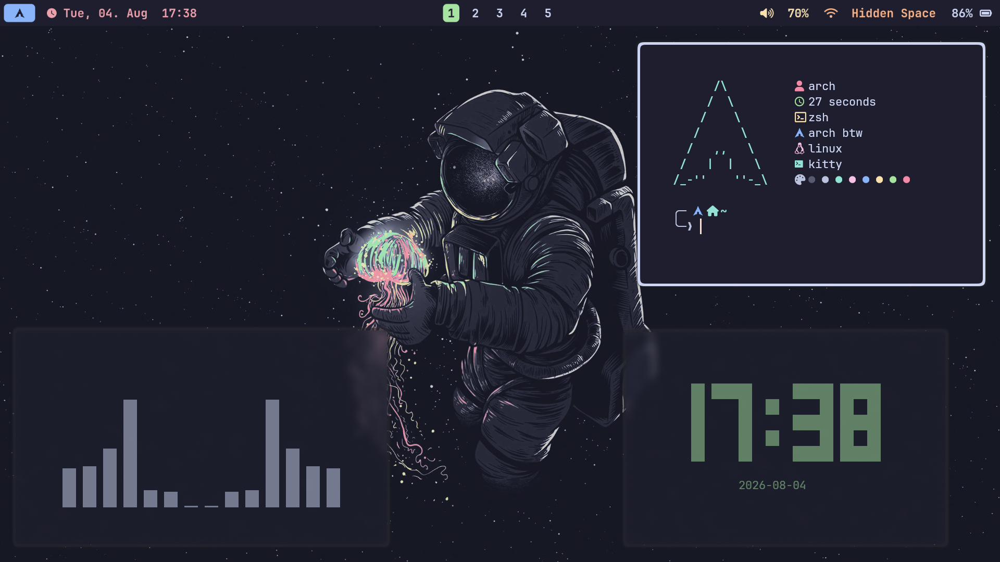
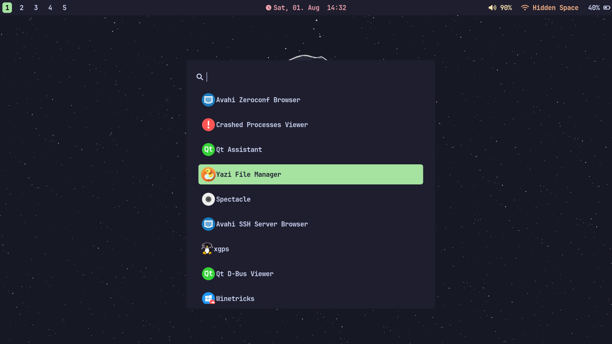

# Installation
```bash
bash <(curl -fsSL https://raw.githubusercontent.com/excellogalihs/friedrice/main/install.sh)
```
That's basically it. You get a usable + beautiful Arch Linux Hyprland setup with the Catppuccin Mocha theme
